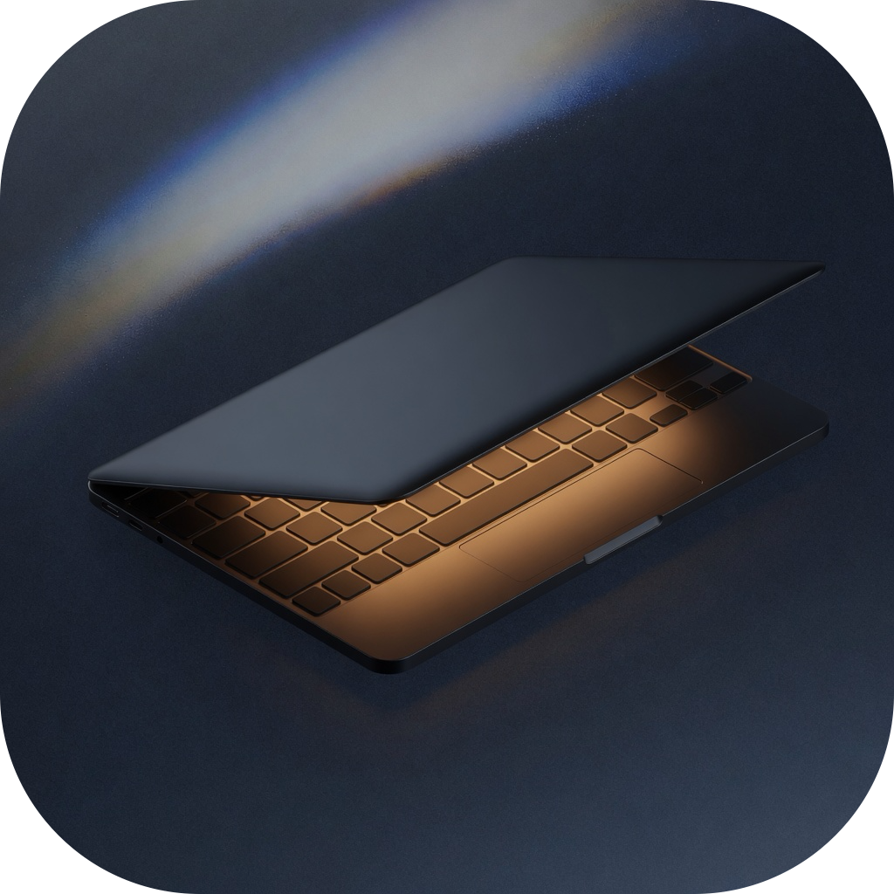

# &nbsp; DontSleep

[English](README.md) · [한국어](README.ko.md) · [简体中文](README.zh-Hans.md) · [日本語](README.ja.md)

[](LICENSE)
[](#설치)
[](#빌드)

**덮개만 닫으면 됩니다. 일은 계속되고, 화면과 키보드는 꺼집니다.**

DontSleep은 macOS 메뉴바 앱입니다. 켜 두고 쓰던 밝기 그대로 덮개를
닫으면 됩니다. 맥은 잠들지 않습니다. 내장 화면과 키보드 백라이트는
클램쉘처럼 꺼지고, 다시 열면 쓰던 밝기로 돌아옵니다. 클릭하면 토글,
오른쪽 클릭하면 메뉴입니다.

<p align="center">
  
</p>

---

## 왜 있나

`caffeinate` 나 KeepingYouAwake 는 **유휴** 슬립만 막습니다. **덮개 닫힘**
슬립은 막지 않습니다. 그걸 바꾸는 공식 스위치는 root 가 필요한
`pmset disablesleep` 뿐입니다.

DontSleep은 그 스위치를 메뉴바에 올려 둡니다. 잠자기만 막으면 내장
화면이 그대로 켜져 있습니다. 덮개를 닫으면 화면과 키보드 불도 끄고,
열면 쓰던 밝기로 되돌립니다.

## 누구를 위한가

이런 경우에 맞습니다.

- 덮개를 닫은 채로 일을 이어갈 때 (출퇴근, 회의실, 오래 도는 작업)
- 터미널이 아니라 메뉴바에서 지금 상태를 보고 싶을 때
- 켤 때마다 비밀번호를 치고 싶지 않을 때

유휴 슬립 앱이 아닙니다. Apple Developer ID 서명이 없습니다
([설치](#설치)).

## 동작

| 조작 | 결과 |
| --- | --- |
| 왼쪽 클릭 | 켜기 / 끄기 |
| 오른쪽 클릭 | 메뉴 |
| 채워진 노트북 아이콘 | 켜짐 — 덮개 닫아도 깨어 있음. 화면과 키보드는 꺼짐 |
| 윤곽 노트북 아이콘 | 꺼짐 — 덮개를 닫으면 잠 |

메뉴바 아이콘은 라이트/다크를 따릅니다. 언어는 macOS를 따릅니다. 영어,
한국어, 중국어 간체, 일본어.

## 설치

릴리즈는 **ad-hoc 서명**이고 공증되어 있지 않습니다. 지금 macOS(Tahoe)에서
받은 앱을 Finder로 열면 **휴지통으로 이동**만 나옵니다. Gatekeeper는
실행하는 앱을 보므로, 디스크 이미지에서 quarantine을 지워도 소용이
없습니다. 앱을 받아서 더블클릭하지 마세요.

다음 한 줄이 앱을 복사하고, 그 복사본의 quarantine을 지운 뒤
DontSleep을 엽니다.

```sh
curl -fsSL https://raw.githubusercontent.com/innocarpe/dontsleep/main/install.sh | zsh
```

첫 창에 작은 터미널이 있습니다. Enter를 누르면 macOS가 비밀번호를
한 번 묻고, **지금 계정에만** `/etc/sudoers.d/dontsleep` 를 씁니다.
허용하는 명령은 다음뿐입니다.

```
pmset -a disablesleep 1
pmset -a disablesleep 0
```

`sudo` 전체를 열지 않습니다.

파이프가 불편하면 먼저 [install.sh](install.sh) 를 읽으면 됩니다.
디스크 이미지가 이미 있으면: `zsh install.sh ~/Downloads/DontSleep-*.dmg`.

지울 때: `sudo rm /etc/sudoers.d/dontsleep`.

### 소스에서

```sh
git clone https://github.com/innocarpe/dontsleep.git
cd dontsleep
./build.sh
```

`build.sh` 는 `/Applications/DontSleep.app` 에 설치합니다. helper는
첫 창에서 끝냅니다. 셸에서 하려면 `./scripts/install-sudoers.sh`.

## 사용

첫 실행이 설정입니다. 메뉴의 **쓰는 법…** 에서 다시 열립니다.

메뉴바에 두고 씁니다. 쓰던 밝기 그대로 덮개를 닫으면 됩니다. 가방
전에 끄세요. **로그인 시 열기** 는
`~/Library/LaunchAgents/com.innocarpe.dontsleep.plist` 를 씁니다.

**과열 경고 시 잠자기** 는 기본이 꺼져 있습니다. 덮개를 닫아 쓰는 중
맥이 과열 경고를 보내면 DontSleep을 끄고 바로 잠듭니다.

배터리를 확인하세요.

## 빌드

Xcode Command Line Tools (Swift + `hdiutil`) 가 필요합니다.

```sh
./scripts/build-app.sh            # dist/DontSleep.app
./scripts/package-dmg.sh          # DontSleep-<version>.dmg
./scripts/make-icons.sh           # icns / 메뉴바 PDF 다시 만들기
```

## 라이선스

[Apache License 2.0](LICENSE)
